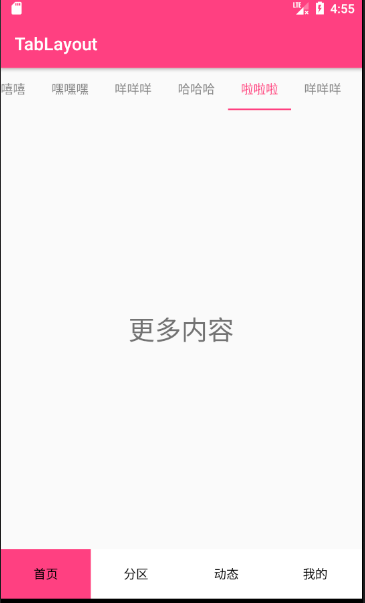

# TabLayout

Using sharePreference to cheack whether the first or not to sure which page to load. And with viewpaper and tablayout .. to finish the main fragment .
 
main fragment
 

<p2>
First load 
</p2>
<p2>
second or more times to load 
</p2>
